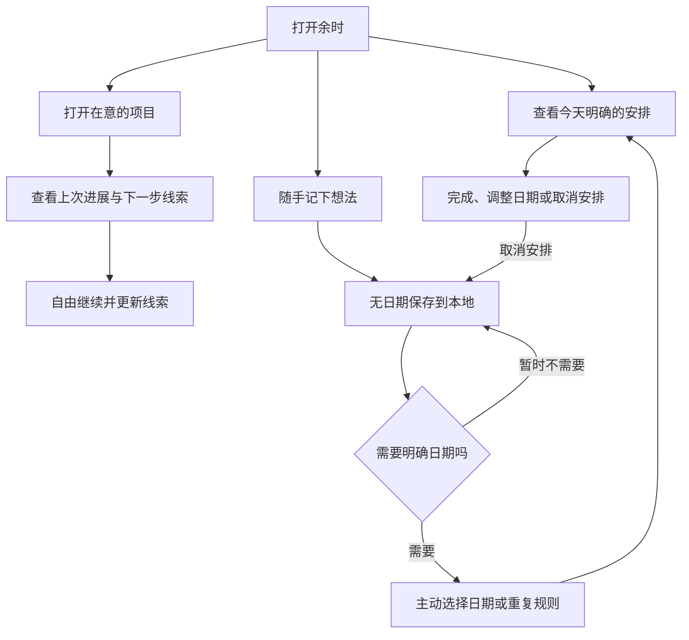

# 余时 0.2：记住与继续

> 本文为 0.2 过渡方案；当前业务流程以 [0.3 业务重构](spaces.md) 为准。

本文件更新产品定位；旧文档中“默认今日重点、收集后必须整理排期、以完成率评估一周”的设计不再适用。

## 行为准则

- 记录是保存想法，不代表承诺。标题即可保存，日期和时长均可省略。
- 首页展示明确安排，同时提供项目上下文和想法入口，不自动推荐重点，不要求清空。
- 项目保存最新的过程说明和下一步线索；两项均选填，不强制设置成果或周期目标。
- 有日期的事情仍可在节奏页查看和完成。重复规则由用户主动设置。
- 取消安排会清除计划日期、时间和重复规则，保留标题、备注、项目关联、真实截止日与完成历史。
- 过去未完成的安排留在原日期，首页折叠展示，不自动滚入今天。
- 周统计保留主动查询的安排和完成记录，不显示完成率、最佳一天或留白天数评分。
- 分享图包含今天全部可分享安排，保留图标与生成时间。私密内容仍默认隐藏。
- 小组件显示今日安排及完成操作，不用完成数量评价一天；无日期记录不自动进入小组件。

## 数据兼容

ProjectItem 新增可选文本 `lastProgress`、`nextStep`，旧数据库及 JSON 备份缺省为空。原 `weekGoal` 保留并在项目详情展示。导出包含新字段，当前版本导入时完整恢复。

TaskItem 的原字段和状态保持兼容。无日期新记录为 inbox，默认 estimateMins 为 0（UI 表示“不估算”）。已有安排、时长、重复和完成记录不自动转换。

项目线索保存的是当前上下文，不是版本历史；后一次保存替换同字段的旧内容。当前版本不增加提醒、自动推荐或强制每日问答。

## 业务流程

