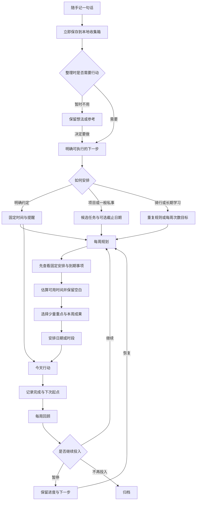
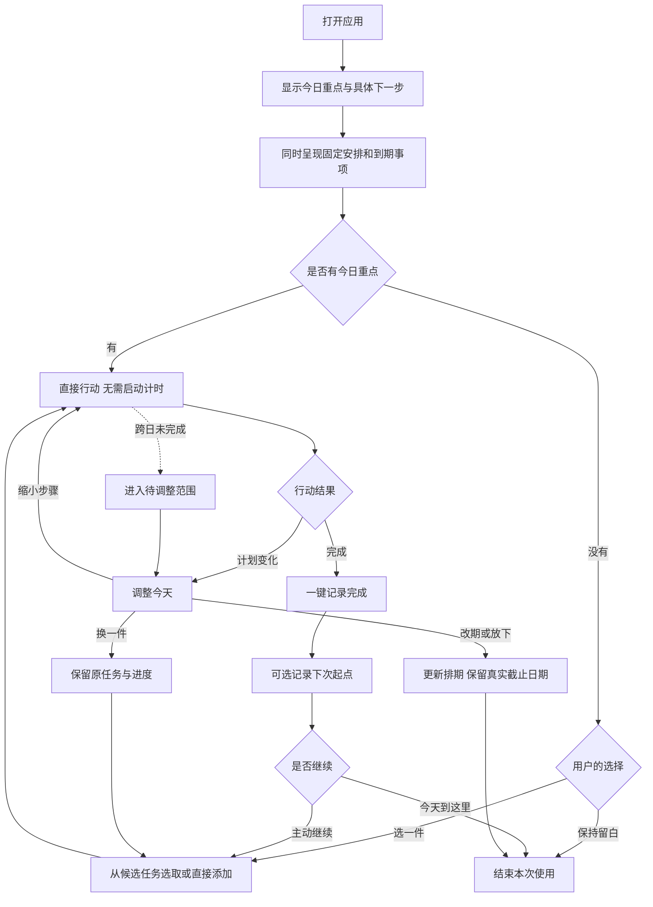
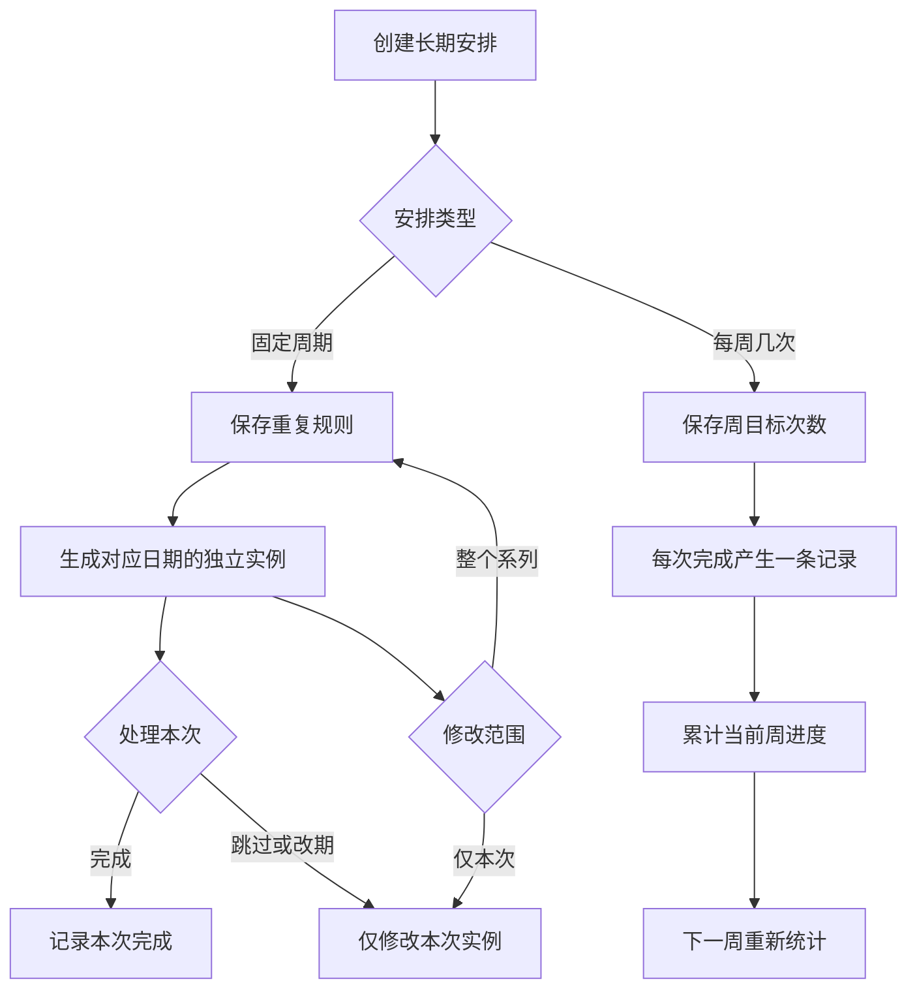
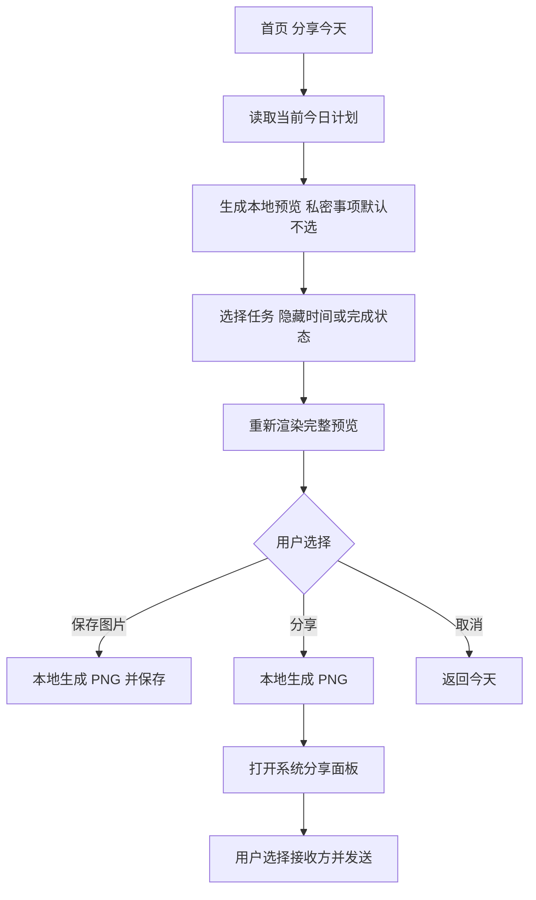
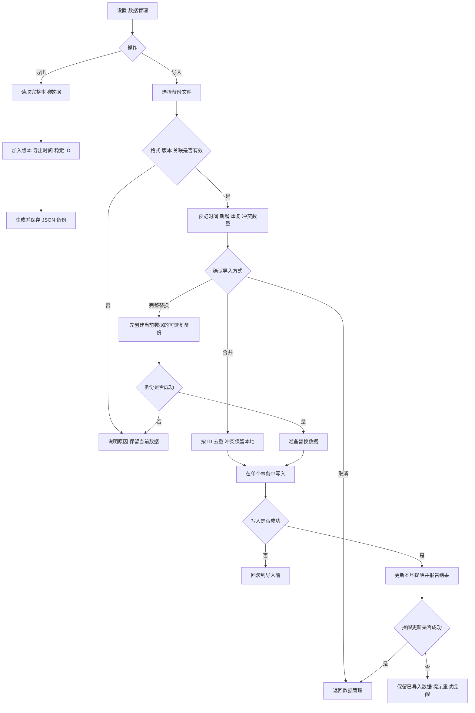

# 余时 · 业务流程

> 0.3 当前流程见 [随手留下，随时回来](spaces.md)。以下保留为早期规划记录，不作为当前交互要求。

本文是产品目标流程；实际已实现能力以 README 中的交付说明为准。

## 1. 从想法到行动

临时事项可以直接进入今天。周规划是整理入口，不是每条任务必须经过的审批步骤。

## 2. 今天的操作

每日一件重点是展示默认值，不是任务数量上限。未完成不会全部自动滚入明天，真实截止事项仍需持续可见。

## 3. 重复安排与周目标

规则和实例分别保存。未达成次数留在历史周记录中，不增加下一周目标。

## 4. 分享今天的计划图片

预览不自动包含备注、收集箱和其他日期的安排。生成不依赖在线 AI 服务；图片是静态快照。

## 5. 备份与恢复

文件备份与数据库事务是两个阶段。只有替换前备份成功才进入替换事务；提醒失败不会伪装成数据导入失败。

## 6. 状态与边界

| 动作 | 改变 | 保留 |
| --- | --- | --- |
| 完成任务 | 当前任务或当前实例的完成状态 | 项目、历史记录 |
| 改期 | 计划日期或时间段 | 真实截止日期 |
| 今天放下 | 今日排期或重点选择 | 任务内容、已有进度 |
| 暂停项目 | 项目参与规划的状态 | 历史、下一步 |
| 归档 | 活跃列表中的展示状态 | 可查询的历史数据 |
| 撤销完成 | 对应任务或实例的状态 | 其他任务与实例 |
| 合并导入 | 新 ID 对应的数据 | 本地冲突记录 |
| 替换导入 | 事务成功后的全部业务数据 | 替换前可恢复备份 |
