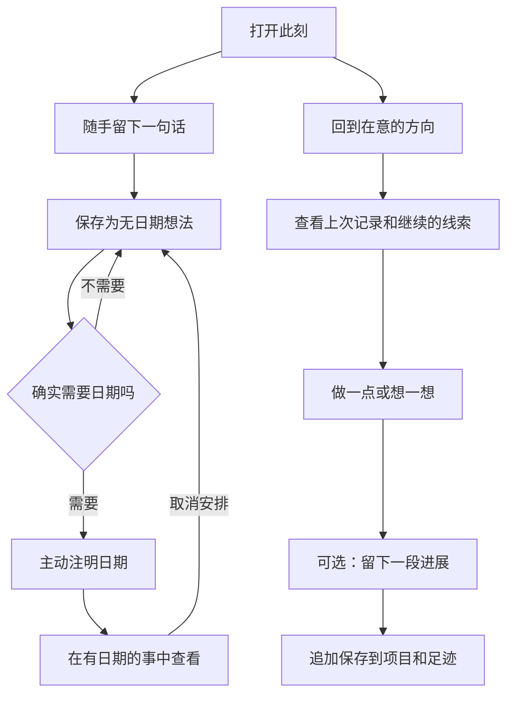

# 余时 0.3：随手留下，随时回来

应用以个人方向、想法和经历为核心。主导航为「此刻」「在意」「足迹」。不再有每周格子、周分析、完成率或每天必须选择重点的流程。

## 此刻

首先呈现一句话记录。最近更新的两个进行中项目作为返回入口，其余项目在「在意」中完整保留。展示最近三条想法，可打开「全部想法」。没有清空要求，不自动把想法安排到今天。

今天确有主动注明日期的事时，以折叠的「今天有约定」保存入口，不作为首页主体。

## 在意

项目表示长期在意的方向，可以是爱好、学习或个人项目。可以暂停、恢复、归档，已归档项目可永久删除。

打开项目可查看上次记录，保存下一步线索，留下一段新进展。每段非空进展追加到时间记录中，不覆盖之前的内容。只改下一步不产生空记录。

相关想法默认没有日期和时长要求。完成只是事项的一种可选操作，不是记录过程的前置条件。

## 足迹

按时间回看项目进展与主动标记做过的事。不比较哪天完成更多，不显示连续打卡、百分比或欠账。归档项目的足迹仍可回看；永久删除项目时其足迹随项目删除。

## 有日期的事

右上角日历单独打开。默认展示接下来 30 天实际有安排的日期，不绘制空白周格子。可查找日期，可主动创建约定、设置重复规则。过去未完成事项折叠保留在原日期，不自动结转。

取消安排清除计划日期、时间和重复规则，保留原文、项目关联、真实截止日和历史记录。今天安排的完整分享图仍在此入口内；私密事项默认隐藏。

安卓小组件继续显示主动设置的当天安排，保留直接完成操作，不展示完成数量或重点星标。

## 数据兼容

ProjectItem 的 `lastProgress`、`nextStep` 为当前上下文；新增 `progress` 数组保存 `{text, createdAt}`。旧库和备份缺省为空数组。在旧项目第一次保存进展时，先保留旧 `lastProgress` 为历史记录，再追加新记录。`weekGoal` 原文仍在项目详情可读，不再作为计划指标。

已有任务、日期、重复、完成历史和归档均保留。备份继续使用现有格式版本；当前版本读写新增字段，合并时同 ID 项目遵循原有「保留当前版本」规则，不自动拼接两份历史。

## 业务流程

